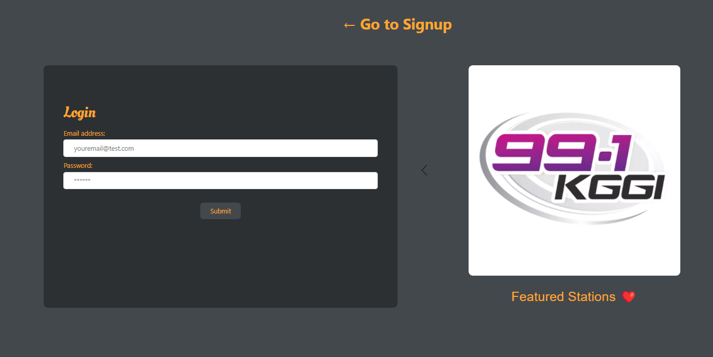
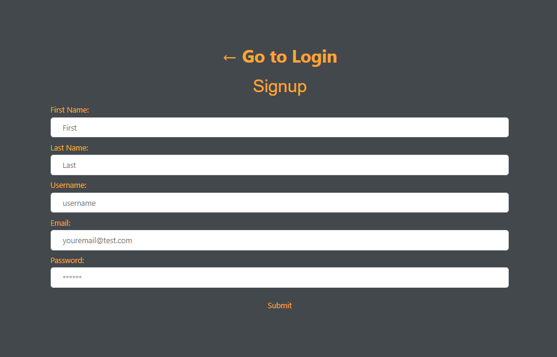
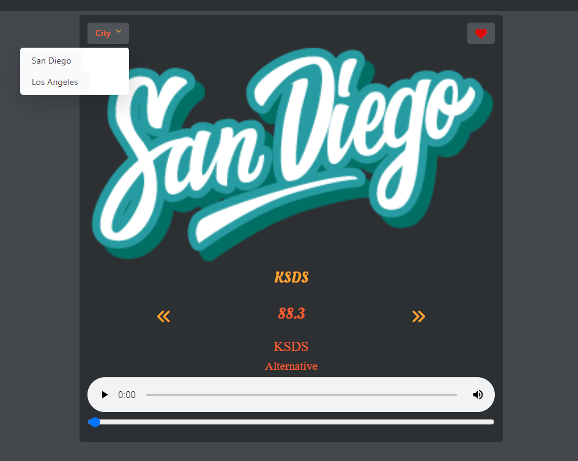
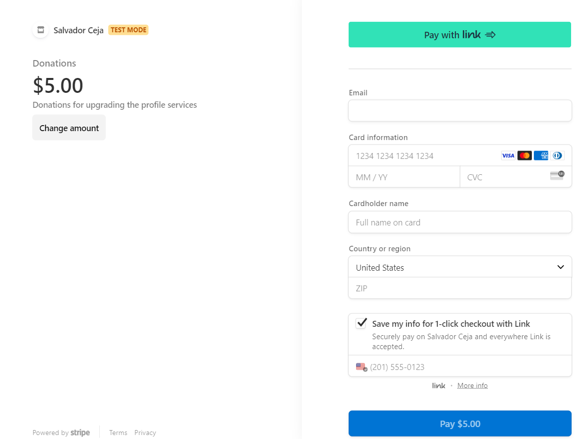

# <Radioheadz>

## Description

- We embarked on this project to address a gap in related apps. In this application, users can search for stations by city. Once the desired city is found, users have the option to select stations that might not be available in other applications. Constructing this application presented challenges, particularly in setting up the backend. As new developers, we sought guidance when faced with coding obstacles. Despite this challenge, we learned how to collaborate more effectively as a team. We adopted a team style that leveraged each member's strengths.

## Installation

- Installing this app is relatively simple. Visit our provided repository using the links at the bottom. Select the project repository and clone it to your local environment. To run the application, open the file with your code editor, perform an npm i to install all required dependencies, and run npm run develop in the terminal to view the app running on your local machine.

## Usage

- To use the application, follow the provided link below. Clicking it will direct you to the application. Once there, you can log in or sign up, depending on whether you have an existing account.
  
  
- Upon login, you'll reach the homepage featuring the radio tuner. Here, you can select a city and cycle through existing radio stations. Additionally, you can add stations to your favorites, populating the user's favorite preset buttons.
  
- Subsequently, scroll through the stations, choose one, and hit the play button to start streaming audio for as long as you like.
  
- Finally, an important feature for the application's future is the option to donate for ongoing development. This link will direct you to a new page, providing an opportunity to support our ongoing efforts. When finished, simply log out.
  

## Repo:

- GitHub Repo: https://github.com/Sal1316/radioheadz

## Credits

- Collaborators:
  - https://github.com/Sal1316
  - https://github.com/rambriz91
  - https://github.com/1014jorge
  - https://github.com/Marc01710
  - https://github.com/makandcheese04
